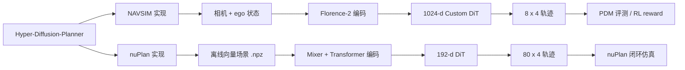
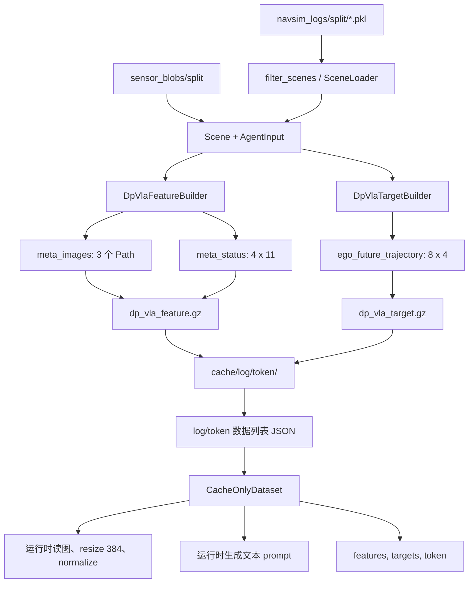
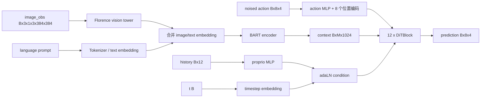
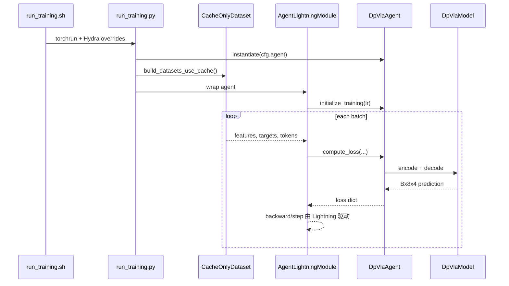
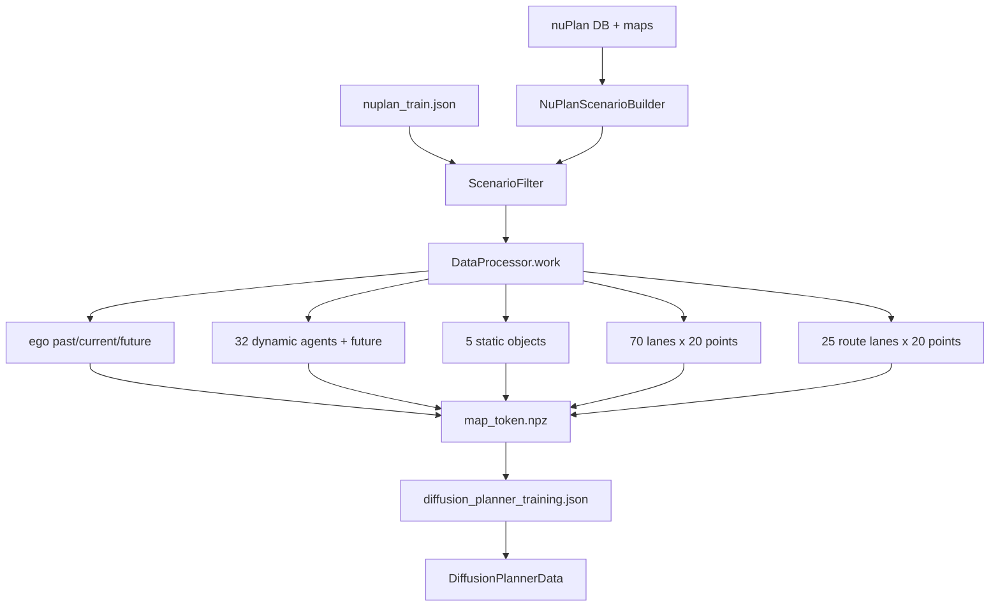
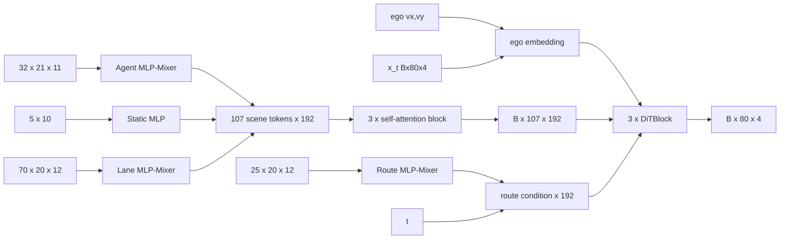
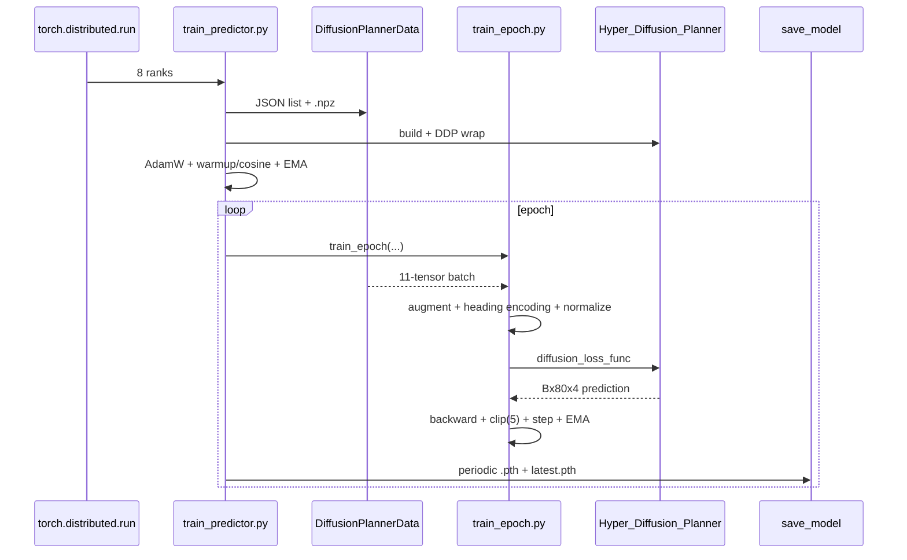

# Hyper-Diffusion-Planner 架构、数据流与代码索引

> 基于当前仓库代码整理，检查日期：2026-07-20。
>
> 本文描述的是**当前 checkout 的真实代码路径**，并在必要时区分论文/注释中的设计意图与当前实际实现。仓库依赖的 NAVSIM、nuPlan devkit、Florence-2 和 PDM scorer 内部实现不在本仓库中，本文追踪到调用边界为止。

## 1. 仓库总览

仓库包含两套相互独立、共享“扩散轨迹规划”思想的实现：

| 子项目 | 输入模态 | 场景编码器 | 轨迹解码器 | 训练框架 | 主要输出 |
| --- | --- | --- | --- | --- | --- |
| `HDP-navsim/` | 三路前视相机、文本化车辆状态、4 帧 ego 位姿 | Florence-2 vision tower + BART encoder | 12 层、1024 维 Custom DiT | Hydra + PyTorch Lightning；RL 阶段还使用 Ray/PDM | 8 个未来点，4 s，2 Hz |
| `HDP-nuplan/` | ego、动态体、静态物、车道、路线等向量特征 | MLP-Mixer + Transformer self-attention | 3 层、192 维 DiT | argparse + PyTorch DDP | 80 个未来点，8 s，10 Hz |

顶层说明位于 [`README.md`](README.md)。NAVSIM 和 nuPlan 的快速使用说明分别位于 [`HDP-navsim/README.md`](HDP-navsim/README.md) 与 [`HDP-nuplan/README.md`](HDP-nuplan/README.md)。



### 1.1 两套实现的共同扩散形式

两套实现都先把未来轨迹表示为四维动作：

```text
[x, y, cos(heading), sin(heading)]
```

训练时从干净轨迹 `x_0` 采样时间 `t` 和高斯噪声 `epsilon`，构造：

```text
x_t = alpha(t) * x_0 + sigma(t) * epsilon
```

随后用 DiT 在场景条件和时间条件下预测 `noise`、`score`、`x_start`，nuPlan 版本还支持 `v`。推理时从高斯噪声开始，由 DPM-Solver++ 迭代还原轨迹。

两者的主要差异是：

- NAVSIM 的上下文来自 Florence-2 的图像/文本 token，动作长度为 8。
- nuPlan 的上下文来自结构化向量场景 token，动作长度为 80。
- NAVSIM 另有一条 PDM reward 驱动的离线缓存式 RL 微调链路。

## 2. 一眼找到所有入口

| 任务 | 推荐入口 | 实际 Python 入口 |
| --- | --- | --- |
| NAVSIM 监督缓存 | `HDP-navsim/scripts/training/run_cache_training.sh dp_vla_agent ...` | `hdp_navsim/training/run_cache_training.py:79` |
| NAVSIM RL encoder 缓存 | 同一脚本，agent 改为 `dp_vla_rl_agent` | `hdp_navsim/training/run_cache_training_multi_node.py:135` |
| NAVSIM 监督训练 | `HDP-navsim/scripts/training/run_training.sh` | `hdp_navsim/training/run_training.py:30` |
| NAVSIM RL 微调 | `HDP-navsim/scripts/training/run_training_rl.sh` | 同一个 `run_training.py:30`，但实例化 `DpVlaRlAgent` |
| NAVSIM PDM metric cache | `HDP-navsim/scripts/evaluation/run_metric_caching.sh` | 上游 NAVSIM `run_metric_caching.py` |
| NAVSIM PDM 评测 | `HDP-navsim/scripts/evaluation/run_pdm_score.sh` | 上游 NAVSIM `run_pdm_score.py` |
| nuPlan 离线预处理 | `HDP-nuplan/data_process.sh` | `HDP-nuplan/data_process.py:36` |
| nuPlan DDP 训练 | `HDP-nuplan/torch_run.sh` | `HDP-nuplan/train_predictor.py:109` |
| nuPlan 闭环仿真 | `HDP-nuplan/sim_hdp_runner.sh` | 上游 nuPlan `run_simulation.py`，本地 planner 为 `planner.py:28` |

---

# 3. NAVSIM 实现

## 3.1 配置和路径是如何合成的

NAVSIM 子项目使用 Hydra。训练总配置入口是 [`default_training.yaml`](HDP-navsim/hdp_navsim/config/training/default_training.yaml)，其 defaults 组合：

```text
train_test_split + default_evaluation（来自 NAVSIM）+ agent + worker + _self_
```

关键位置：

- Hydra 入口与实例化：`HDP-navsim/hdp_navsim/training/run_training.py:29-45`
- 训练器默认参数：`HDP-navsim/hdp_navsim/config/training/default_training.yaml:33-70`
- 统一模型参数：`HDP-navsim/hdp_navsim/config/agent/_shared/model.yaml:10-21`
- 扩散/Solver 参数：`HDP-navsim/hdp_navsim/config/agent/_shared/diffusion_sde.yaml:9-25`
- 轨迹采样周期：`HDP-navsim/hdp_navsim/config/agent/_shared/trajectory_sampling.yaml:8-16`
- Florence 和缓存路径：`HDP-navsim/hdp_navsim/config/agent/_shared/paths.yaml:17-29`
- shell 环境变量：`HDP-navsim/env.sh:23-86`
- Python 路径辅助函数：`HDP-navsim/hdp_navsim/paths.py:39-149`

三个监督 agent 配置的区别：

| Hydra agent | 模型输出空间 | 运动学空间 | hybrid waypoint loss |
| --- | --- | --- | --- |
| `dp_vla_agent` | 继承 `DpVlaConfig` 默认值 `noise` | 默认 `waypoint` | 未配置，代码回退为 `0` |
| `dp_vla_agent_base` | `noise` | `waypoint` | `0` |
| `dp_vla_agent_hdp` | `x_start` | `diff`，即 `dx,dy` | `0.05` |

对应配置位于：

- `HDP-navsim/hdp_navsim/config/agent/dp_vla_agent.yaml`
- `HDP-navsim/hdp_navsim/config/agent/dp_vla_agent_base.yaml:32-38`
- `HDP-navsim/hdp_navsim/config/agent/dp_vla_agent_hdp.yaml:32-38`

注意：标准 `run_training.sh` 明确传入的是 `agent=dp_vla_agent`，不是 `dp_vla_agent_hdp`；要训练 HDP diff + hybrid 版本，需要在命令行覆盖 `agent=dp_vla_agent_hdp`。

## 3.2 原始数据到 Scene/AgentInput

### 3.2.1 场景切分

`SceneLoader` 是仓库内的轻量数据加载实现：

1. `filter_scenes()` 遍历 `navsim_logs/<split>/*.pkl`。
2. 按 `num_history_frames + num_future_frames` 切成窗口。
3. 按 `frame_interval`、route、token、log 和最大场景数过滤。
4. 当前帧 token 映射到原始 frame list 和 log name。
5. 按需物化成 `Scene` 或 `AgentInput`。

代码位置：

- 场景过滤：`HDP-navsim/hdp_navsim/training/training_utils/dataloader.py:12-64`
- token 索引与物化：`dataloader.py:67-161`
- 本地 `Scene`/`AgentInput` 数据类：`training_utils/dataclasses.py:145-216,282-553`
- scene filter：`training_utils/dataclasses.py:555-596`

本地数据类保留了 NAVSIM v1.1 风格的数据入口，同时做了一个重要改动：相机字段保存 `Path`，不在建 Scene 时立刻解码图片，见 `training_utils/dataclasses.py:72-84`。这样缓存中保存的是图片路径，不是巨大的像素数组。

### 3.2.2 四帧 ego 状态

`AgentInput.from_scene_dict_list()` 把 4 帧全局 ego pose 转到**当前 ego 坐标系**，然后每帧形成 11 维 `meta_status`：

| 切片 | 含义 | 维度 |
| --- | --- | --- |
| `0:3` | `x, y, heading` | 3 |
| `3:7` | driving command one-hot | 4 |
| `7:9` | `vx, vy` | 2 |
| `9:11` | `ax, ay` | 2 |

实现位于 `DpVlaFeatureBuilder._get_state_feature()`：`HDP-navsim/hdp_navsim/agent/dp_vla/preprocessing/dp_vla_feature_builder.py:66-87`。

真正送入 DiT 的 `history/proprio` 只取每帧前三维并展平：

```text
meta_status [4, 11] -> meta_status[:, :3] -> history [12]
```

驾驶命令、速度和加速度不直接进入 `proprio`，而是在 `get_language_promt()` 中转成文本提示，代码位于 `training_utils/dataset.py:62-104`。

## 3.3 监督缓存数据流



缓存入口 `run_cache_training.py` 的执行顺序为：

1. 先用 `SensorConfig.build_no_sensors()` 建立全量 token 索引，避免枚举阶段读图。
2. 按 log 将 token 分发给配置的 worker pool。
3. worker 内重新实例化 agent，用 agent 的 sensor config 构建带传感器的 `SceneLoader`。
4. 构造 `Dataset`；其构造函数会调用 `cache_dataset()`。
5. 每个 token 写入 feature/target 两个 gzip pickle。
6. 主进程写 `<log>/<token>` 形式的 JSON 数据列表。

对应代码：

- 缓存主入口：`HDP-navsim/hdp_navsim/training/run_cache_training.py:43-115`
- 单 token 缓存：`training/training_utils/dataset.py:287-310`
- gzip pickle I/O：`dataset.py:126-137`
- 数据列表生成：`dataset.py:140-160`

### 3.3.1 监督缓存的字段和形状

默认 4 帧历史、4 秒未来、0.5 秒间隔：

| 文件 | 字段 | 单样本形状/类型 | 说明 |
| --- | --- | --- | --- |
| `dp_vla_feature.gz` | `meta_images` | 3 个 Path | 当前帧 `cam_l0, cam_f0, cam_r0` |
| `dp_vla_feature.gz` | `meta_status` | `[4, 11]` | 4 帧 ego 局部状态 |
| `dp_vla_target.gz` | `ego_future_trajectory` | `[8, 4]` | `x,y,cos(yaw),sin(yaw)` |

`CacheOnlyDataset` 读取监督缓存时再生成：

| 字段 | batch 前形状 | 生成位置 |
| --- | --- | --- |
| `features.image_obs` | `[3,1,3,384,384]` | `dataset.py:44-59,220-223` |
| `features.language` | Python 字符串 | `dataset.py:62-104,221-223` |
| `features.history` | `[12]` | `dataset.py:224` |
| `targets.ego_future_trajectory` | `[8,4]` | `dataset.py:226-230` |
| 返回的 token | 字符串 | `dataset.py:211,232` |

图片使用 ImageNet mean/std 归一化；尽管函数接收 `training` 参数，当前 `get_image()` 实际固定使用 `IMAGE_PREPROCESS_TEST`，没有使用已定义的 color jitter 训练变换，见 `dataset.py:35-59`。

## 3.4 RL feature cache

RL 训练不在线加载 Florence-2。它先通过缓存脚本执行冻结的 VLM 编码器：

```text
图片 Path + meta_status
  -> 图片张量 + 文本 prompt
  -> tokenizer
  -> DpVlaModel.encode(Florence-2)
  -> encoder_output + meta_status
  -> dp_vla_rl_feature.gz
```

关键代码：

- `DpVlaRlFeatureBuilder`：`HDP-navsim/hdp_navsim/agent/dp_vla/preprocessing/dp_vla_rl_feature_builder.py:29-77`
- Florence 前向：同文件 `42-56`
- 输出落 CPU：同文件 `69-74`
- RL cache 的目标仍继承标准 8×4 目标：`preprocessing/dp_vla_rl_target_builder.py`
- 多 GPU token 分片：`training/run_cache_training_multi_node.py:109-195`

RL cache 读取后的训练输入为：

```text
features.encoder_output: [M, 1024]
features.history:        [12]
target:                  [8, 4]
token:                   str
```

其中 `M` 是 Florence 合并图像 token 和文本 token 后的序列长度。

## 3.5 NAVSIM 网络模块

### 3.5.1 总体结构



顶层模型是 `DpVlaModel`：`HDP-navsim/hdp_navsim/agent/dp_vla/model/modeling_dp_vla.py:109-143`。

默认参数由 `DpVlaConfig` 定义，Hydra 的 shared model YAML 在训练时覆盖同名字段：

```text
hidden_size=1024, depth=12, heads=16
num_actions=8, dim_action=4, dim_y=12
mlp_ratio=4
```

代码位置：

- Python fallback：`model/configuration_dp_vla.py:13-29`
- Hydra source of truth：`config/agent/_shared/model.yaml:10-21`

### 3.5.2 Florence-2 编码器

`DpVlaModel.__init__()` 使用 `AutoModelForCausalLM.from_pretrained(..., trust_remote_code=True)` 加载 Florence-2，随后删除未使用的语言 decoder 和 LM head，见 `modeling_dp_vla.py:123-143`。

`DpVlaModel.encode()`：

1. 输入图片形状为 `[B,V,F,C,H,W]`。
2. 将 `B,V,F` 展平，对每个视角/帧运行 Florence vision tower。
3. 将所有 image token 与文本 embedding 合并。
4. 送入 Florence 的 BART encoder。
5. 返回 `last_hidden_state [B,M,1024]` 和 `attention_mask [B,M]`。

代码：`modeling_dp_vla.py:371-401`。

### 3.5.3 Custom DiT 解码器

`CustomDiT` 位于 `model/decoder.py:50-122`：

- 动作 `x_t [B,8,4]` 经过 MLP 投影到 1024 维。
- 叠加 8 个可学习的正弦初始化位置 token。
- `timestep embedding + history MLP([12] -> [1024])` 形成条件 `y`。
- 经过 12 个 `DiTBlock`。
- final layer 输出 `[B,8,4]`。

每个 `DiTBlock` 的真实顺序为：

```text
self-attention
-> self MLP
-> cross-attention(Florence context)
-> cross MLP
```

四个分支均由 12 路 adaLN-Zero 参数调制，代码位于 `model/DiT.py:124-154`。

### 3.5.4 LoRA 能力与当前实际使用

`DpVlaModel` 实现了两个 decoder LoRA adapter：`positive` 和 `negative`：

- 初始化：`modeling_dp_vla.py:147-165`
- 保存/加载：`modeling_dp_vla.py:231-298`
- CFG 组合：`(1+scale)*positive - scale*negative`，见 `modeling_dp_vla.py:519-535`

但是当前 `DpVlaRlAgent.initialize_training()` **没有调用** `init_lora_adapter()`，optimizer 直接接收 `self.model.decoder.parameters()`，见 `dp_vla_rl_agent.py:251-266`。因此当前主 RL 路径是**完整 DiT decoder 微调**，不是 LoRA 微调；CFG 双 adapter 只有在显式初始化/加载 LoRA 后才会启用。

## 3.6 NAVSIM 监督 loss

监督训练的总入口是 `DpVlaAgent.compute_loss()`：`HDP-navsim/hdp_navsim/agent/dp_vla/dp_vla_agent.py:402-464`。

### 3.6.1 动作空间

`waypoint` 模式直接使用绝对局部坐标；`diff` 模式只把 `x,y` 改成相邻增量，朝向仍保留 `cos,sin`：

```text
[x_t, y_t, cos_t, sin_t]
  -> [x_t-x_(t-1), y_t-y_(t-1), cos_t, sin_t]
```

转换代码：`dp_vla_agent.py:96-135`。

### 3.6.2 扩散监督

`DiffusionSDE.sample()` 生成 `x_t` 和三套等价 target：

- `noise = epsilon`
- `score = -epsilon / sigma(t)`
- `x_start = x_0`

实现：`model/diffusion_utils/diffusion_sde.py:13-26`。

模型输出空间和 loss 监督空间可以不同，`prediction_to_supervision()` 负责 `noise / score / x_start` 间转换，见 `dp_vla_agent.py:184-217`。

基本损失：

```text
L_diffusion = MSE(convert(model_prediction), supervision_target)
```

### 3.6.3 hybrid waypoint loss

只有 `kinematic_type=diff` 且 `hybrid_loss_weight>0` 时启用：

```text
model prediction
  -> 转成 x_start 增量
  -> detached_integral(dx,dy)
  -> 绝对 waypoint
  -> L_waypoint = MSE(pred_xy, gt_xy)

L_total = L_diffusion + weight * L_waypoint
```

实现：`dp_vla_agent.py:444-458`；NAVSIM 版本的 `detached_integral()` 维度索引正确，位于 `dp_vla_agent.py:220-237`。

## 3.7 NAVSIM 监督训练框架



具体执行：

1. shell 用 `torchrun` 启动 `run_training.py`，脚本见 `scripts/training/run_training.sh:23-41`。
2. Hydra 实例化 agent 和 `AgentLightningModule`。
3. 默认 `use_cache_without_dataset=true`，因此直接构造 `CacheOnlyDataset`，不会建立 raw `SceneLoader`。
4. `AgentLightningModule.setup()` 计算 step 数并调用 `agent.initialize_training(lr)`。
5. `training_step()` 调用 `agent.compute_loss()` 并记录 loss dict。
6. agent 返回 AdamW 和当前恒定 LambdaLR。
7. Lightning 负责 mixed precision、DDP、反向传播、梯度裁剪和保存。

代码位置：

- 总入口：`training/run_training.py:29-93`
- cache-only dataset 选择：`run_training.py:55-71`
- Lightning 生命周期：`training/agent_lightning_module.py:54-107`
- optimizer/scheduler 桥接：`agent_lightning_module.py:171-187`
- 默认 trainer：`config/training/default_training.yaml:49-70`

监督 optimizer 分组：

- Florence encoder：`lr / 10`
- DiT 等其余模块：`lr`

定义见 `dp_vla_agent.py:297-310`。

### 3.7.1 检查点

每个 agent 同时注册：

- Lightning `ModelCheckpoint`：保存完整 `.ckpt`，可恢复 optimizer/trainer 状态。
- `HFExportCheckpoint`：保存 `config.json + model.safetensors`，便于 `DpVlaModel.from_pretrained()` 加载。

代码：

- callback 注册：`dp_vla_agent.py:482-500`、`dp_vla_rl_agent.py:785-800`
- HF 导出实现：`training/training_utils/hf_export.py:31-98`
- 通用 checkpoint loader：`agent/dp_vla/utils.py:60-166`

当前监督和 RL callback 都传入 `mode="full"`，所以 RL 也会导出完整 decoder 权重，而不是 LoRA-only 目录。

## 3.8 NAVSIM 推理与 PDM 评测

### 3.8.1 单场景推理

`DpVlaAgent.compute_trajectory()`：`dp_vla_agent.py:331-359`。

```text
AgentInput
-> DpVlaFeatureBuilder.compute_features()
-> image_obs + language + history
-> tokenizer + Florence encode
-> Gaussian x_T [1,8,4]
-> DPM-Solver++ 多步去噪
-> diff_to_waypoint（如需要）
-> atan2(sin,cos)
-> NAVSIM Trajectory [8,3]
```

默认共享 SDE 配置声明 `sample_steps=25`，但 `DpVlaModel.generate()` 自身的 `steps` 默认参数是 10，且 agent 推理未显式覆盖，所以当前普通推理实际使用 10 步；`DiffusionSDE.generate()` 将传入的步数交给 solver。相关位置为：

- `modeling_dp_vla.py:487-553`
- `diffusion_sde.py:28-43`
- `_shared/diffusion_sde.yaml:21-25`

### 3.8.2 PDM metric cache 与评分

PDM 链路有两种缓存：

- feature cache：模型训练输入，`.gz`。
- metric cache：PDM 仿真/评分所需的场景、地图和 proposal 上下文，`.lz`。

`run_metric_caching.sh` 调上游 NAVSIM 的 `run_metric_caching.py` 生成 `.lz`；`run_pdm_score.sh` 调上游 `run_pdm_score.py`，其概念流程为：

```text
agent.initialize(checkpoint)
-> agent.compute_trajectory(scene)
-> PDM simulator
-> PDM scorer
-> PDMS/各子指标
```

脚本位置：

- `HDP-navsim/scripts/evaluation/run_metric_caching.sh:16-30`
- `HDP-navsim/scripts/evaluation/run_pdm_score.sh:18-27`

仓库另有 `HDP-navsim/hdp_navsim/run_pdm_score_ddp.py`，实现按 rank 分 token 的自定义 DDP 评分，但标准评测 shell 没有调用它，应视为辅助/实验入口。

## 3.9 NAVSIM RL 训练数据流

```mermaid
flowchart TD
    RFC[RL feature cache: encoder_output + history] --> Batch[训练 batch]
    MCache[PDM metric .lz] --> Score[PDM simulator + scorer]

    Batch --> Phase{epoch % update_epoch == 0?}
    Phase -->|是| Roll[Rollout phase]
    Roll --> Repeat[每场景复制 G=10]
    Repeat --> Sample[5-step stochastic DPM sample]
    Sample --> Score
    Score --> Reward[PDM score + details]
    Reward --> Buffer[ReplayBuffer: token, G trajectories, GT, rewards]

    Phase -->|否| Train[Train phase]
    Buffer --> SampleBuf[有放回抽 B 个场景]
    SampleBuf --> Reload[按 token 重读 encoder/history cache]
    Reload --> NormR[group 内 reward 标准化]
    NormR --> RLoss[exp(reward) * per-sample diffusion MSE]
    RLoss --> Decoder[更新完整 DiT decoder]
```

### 3.9.1 初始化

`DpVlaRlAgent.initialize_training()`：

1. `with_encoder=False` 构建模型，仅保留 DiT decoder。
2. 加载监督预训练权重。
3. 建立 feature `CacheExtractor` 和 PDM `MetricCacheLoader`。
4. 创建 PDM simulator/scorer。
5. 启动每节点 Ray。
6. 创建 replay buffer。
7. optimizer 只更新完整 decoder。

代码：`dp_vla_rl_agent.py:251-331`。

### 3.9.2 rollout epoch

当 `current_epoch % replay_buffer_update_epoch == 0`：

- 清空 replay buffer。
- 每个场景复制 `group_size=10` 份条件。
- 用 `rollout_steps=5` 做随机轨迹采样。
- 前 5 个 epoch 对 `x,y` 做局部切向/法向扰动。
- 将 `cos,sin` 转回 heading 后送入 PDM。
- Ray 每条轨迹执行一次 `navsim.evaluate.pdm_score.pdm_score()`。
- 有效组写入 replay buffer。
- 返回 reward/metric 日志，**不返回 `loss`**；Lightning 因此跳过该 batch 的反向传播。

代码：

- phase 切换：`dp_vla_rl_agent.py:459-481`
- rollout：`dp_vla_rl_agent.py:483-598`
- Ray PDM task：`agent/dp_vla/scoring.py:66-128`
- 扰动：`scoring.py:131-149`
- Lightning 跳过无 loss batch：`training/agent_lightning_module.py:85-96`

### 3.9.3 训练 epoch

非 rollout epoch 执行 `_rl_train_step()`：`dp_vla_rl_agent.py:600-688`。

每个 replay 记录包含一个场景的 `G` 条轨迹和 `G` 个 PDM reward。对每组 reward 标准化：

```text
r_hat = (r - group_mean) / (group_std + 1e-6)
w = exp(r_hat)
```

之后重新对 rollout action 加噪并预测，逐样本计算扩散 MSE：

```text
L_RL = mean(exp(r_hat) * MSE(prediction, diffusion_target))
```

若配置为 `diff` 且 hybrid weight 大于 0，还会加入同样 reward 加权的 waypoint MSE。

ReplayBuffer 和按 token 重读缓存的实现位于 `model/rl_utils.py:11-65`。

### 3.9.4 当前 RL 配置中没有进入 loss 的字段

`dp_vla_rl_agent.yaml:44-48` 定义了：

```text
bc_data
progress_weight
ttc_weight
comfortable_weight
```

但当前 `DpVlaRlAgent` 主路径使用 PDM 返回的总 score 作为 `reward_abs`，没有读取上述四个字段。它们目前不是实际 loss 的组成部分。

---

# 4. nuPlan 实现

## 4.1 离线预处理数据流



入口 `HDP-nuplan/data_process.py:36-83`：

1. 读取 `nuplan_train.json` 限制训练 log。
2. 用 `NuPlanScenarioBuilder` 和进程池获取 scenario。
3. `DataProcessor.work()` 遍历 scenario。
4. 每个 scenario 写 `{map_name}_{token}.npz`。
5. 最后写 `.npz` 文件名 JSON 列表。

核心预处理：`HDP-nuplan/hdp_nuplan/data_process/data_processor.py:23-171`。

### 4.1.1 时域与容量

默认设置：

```text
past:   2 s, 20 个过去点 + 当前点 = 21 帧，10 Hz
future: 8 s, 80 个点，10 Hz
agents: 32
static: 5
lanes:  70 x 20 points
route:  25 x 20 points
radius: 100 m
```

定义位于 `data_processor.py:28-40` 和 `data_process.py:46-53`。

### 4.1.2 `.npz` 字段与形状

| 字段 | 默认形状 | 含义 |
| --- | --- | --- |
| `ego_current_state` | `[10]` | `x,y,cos,sin,vx,vy,ax,ay,steering,yaw_rate` |
| `ego_agent_future` | `[80,3]` | `x,y,heading`，当前 ego 局部坐标 |
| `neighbor_agents_past` | `[32,21,11]` | 8 维状态 + 3 维类型 one-hot |
| `neighbor_agents_future` | `[32,80,3]` | `x,y,heading`；dataset 默认只取前 10 个，但当前 loss 不使用 |
| `static_objects` | `[5,10]` | 6 维几何 + 4 维类型 one-hot |
| `lanes` | `[70,20,12]` | 8 维几何 + 4 维交通灯 one-hot |
| `lanes_speed_limit` | `[70,1]` | 速度限制 |
| `lanes_has_speed_limit` | `[70,1]` bool | 是否有速度限制 |
| `route_lanes` | `[25,20,12]` | route 上的 lane 特征 |
| `route_lanes_speed_limit` | `[25,1]` | route 速度限制，当前 decoder 未使用 |
| `route_lanes_has_speed_limit` | `[25,1]` bool | 当前 decoder 未使用 |

来源：

- ego current：`data_process/ego_process.py:67-98`
- ego future：`ego_process.py:53-64`
- 动态体选择、padding、类型编码：`agent_process.py:204-334`
- 动态体 future：`agent_process.py:337-350`
- lane 12 维拼接：`map_process.py:259-281`
- lane/route 输出：`map_process.py:384-417`

`DiffusionPlannerData.__getitem__()` 按固定顺序返回 11 个 tensor，训练循环依赖这一位置顺序，见 `hdp_nuplan/utils/dataset.py:17-49`。

### 4.1.3 训练与在线推理使用同一套特征处理

离线使用 `DataProcessor.work()`；仿真时使用 `DataProcessor.observation_adapter()`。后者从 `PlannerInput.history`、traffic light、map API 和 route roadblock 构造与 `.npz` 同构的模型输入，代码位于 `data_processor.py:42-91`。

归一化由 `ObservationNormalizer` 完成：只归一化非零 padding 项，见 `hdp_nuplan/utils/normalizer.py:31-70`。参数文件为 [`normalization.json`](HDP-nuplan/normalization.json)。

训练时可调用 `StatePerturbation` 扰动当前 ego，并用 quintic 插值修正前 2 秒未来轨迹，再把所有实体重心化到扰动后的 ego 坐标，入口为 `hdp_nuplan/utils/data_augmentation.py:41-258`。

## 4.2 nuPlan 网络结构



顶层组装位于 `HDP-nuplan/hdp_nuplan/model/hyper_diffusion_planner.py:9-104`。

### 4.2.1 场景 Encoder

`Encoder` 位于 `model/module/encoder.py:9-65`。默认 token 数：

```text
32 agents + 5 static objects + 70 lanes = 107 tokens
```

三个分支：

1. `AgentFusionEncoder`（`encoder.py:86-146`）
   - 每个 agent 的 21 帧、8 维运动状态先加入 valid flag。
   - 沿 feature 和 time 两个轴做 MLP-Mixer。
   - 加入 vehicle/pedestrian/bicycle 类型 embedding。
   - 每个 agent 压成一个 192 维 token。
2. `StaticFusionEncoder`（`encoder.py:148-180`）
   - 10 维静态物特征经过 MLP 得到一个 192 维 token。
3. `LaneFusionEncoder`（`encoder.py:182-266`）
   - 对每条 lane 的 20 个点做 MLP-Mixer。
   - 加入 speed-limit 和 traffic-light embedding。
   - 每条 lane 压成一个 192 维 token。

token 加入 7 维位置/类别 embedding 后，由 3 层 `FusionEncoder` 做全局 self-attention，输出 `[B,107,192]`，见 `encoder.py:269-288`。

### 4.2.2 Route + DiT Decoder

`Decoder` 位于 `model/module/decoder.py:14-116`。

- `RouteEncoder` 仅取 route 的前 4 维，即 `x,y,dx,dy`。
- 将 `25×20` 个点展平后做 MLP-Mixer，池化成一个 192 维 route condition。
- `x_t [B,80,4]` 经 MLP 投影并加 80 个 learned timestep-position embedding。
- 当前 ego 的 `vx,vy` 也投影并加到每个 action token。
- route condition 与 diffusion timestep embedding 相加形成 adaLN 条件 `y`。
- 3 个 DiT block 对 action 做 self-attention，并 cross-attend 107 个 scene token。
- 最终输出 `[B,80,4]`。

代码：

- RouteEncoder：`decoder.py:119-162`
- DiT：`decoder.py:165-218`
- DiTBlock：`model/module/dit.py:66-94`

## 4.3 nuPlan diffusion loss 与 hybrid loss

总入口：`HDP-nuplan/hdp_nuplan/loss.py:9-81`。

### 4.3.1 轨迹表示

GT `ego_future [B,80,3]` 先把 heading 变成 `cos,sin`。之后：

- `x,y` 从绝对 waypoint 变成相邻增量。
- `cos,sin` 保持每个时刻的绝对朝向编码。
- 用 `StateNormalizer(mean=[0,0,0,0], std=[0.5,0.5,1,1])` 归一化。

转换发生在 `train_epoch.py:60-79` 和 `loss.py:24-31`。

### 4.3.2 SDE 参数化转换

nuPlan 支持四种 model/supervision type：

```text
noise, score, x_start, v
```

模型预测的 type 由 `--diffusion_model_type` 决定，loss 空间由 `--diffusion_supervision_type` 决定。`VPSDE_linear.transform()` 先统一转为 noise，再转为目标空间，见 `model/diffusion_utils/sde.py:129-162`。

默认 VP-SDE：`beta_min=0.1, beta_max=20`，见 `sde.py:65-127`。

不同监督的损失：

```text
score:   sum((pred_score * sigma + epsilon)^2)，避免方差爆炸
x_start: sum((pred_x0 - gt_x0)^2)
noise:   sum((pred_epsilon - epsilon)^2)
v:       sum((pred_v - gt_v)^2)
```

最终记为 `ego_planning_loss`，代码位于 `loss.py:45-63`。

### 4.3.3 hybrid waypoint loss

无论模型输出何种 type，都先转换成 `x_start` 增量并反归一化，再积分到绝对位置：

```text
pred_v = transform(model_type -> x_start)
pred_v = inverse_normalize(pred_v)
pred_x = detached_integral(pred_v.xy)
L_waypoint = MSE(pred_x, gt_absolute_xy)

L_total = L_diffusion + planning_hybrid_loss * L_waypoint
```

默认 `planning_hybrid_loss=0.01`；实现位于 `loss.py:65-77` 和 `train_epoch.py:95`。

当前 loss 虽然接收 `neighbors_future` 和 mask，但没有使用它们计算 loss；因此当前模型只训练 ego planning，`predicted_neighbor_num` 也是 deprecated 参数。

## 4.4 nuPlan DDP 训练框架



训练入口 `train_predictor.py`：

1. argparse 读取数据、模型和扩散配置。
2. `ddp_setup_universal()` 初始化进程组。
3. rank 0 建日志目录并保存 `args.json`。
4. 建 `DistributedSampler` 和 DataLoader；命令行 batch size 是总 batch，再除 world size。
5. 建模型并包装 DDP。
6. 建 `ModelEma(decay=0.999)`。
7. AdamW + `CosineAnnealingWarmUpRestarts`。
8. 循环调用 `train_epoch()`。
9. 周期保存 model、EMA、optimizer、scheduler 和元数据。

关键代码：

- 参数：`HDP-nuplan/train_predictor.py:31-103`
- 数据/模型/DDP：`train_predictor.py:109-174`
- epoch loop：`train_predictor.py:187-214`
- 单 epoch：`hdp_nuplan/train_epoch.py:11-126`
- 检查点格式：`hdp_nuplan/utils/train_utils.py:44-99`

训练 optimizer 更新 encoder 和 decoder 全部参数。每 batch 做 `clip_grad_norm_(..., 5)`，随后更新 EMA。

检查点包含：

```text
epoch
model
ema_state_dict
optimizer
schedule
loss
wandb_id
```

## 4.5 nuPlan 推理与闭环仿真

### 4.5.1 模型 eval 分支

`Decoder.forward()` 根据 `self.training` 切换：

- 训练：读取 `sampled_trajectories` 和 `diffusion_time`，单次 DiT 前向。
- 推理：采样 `x_T ~ N(0,0.1^2)`，调用 DPM-Solver++ 10 步还原 `x_0`，反归一化并累积 `dx,dy`。

实现：`model/module/decoder.py:41-116`。

nuPlan sampler 默认：

```text
algorithm = DPM-Solver++
steps = 10
order = 2
skip_type = logSNR
method = multistep
denoise_to_zero = true
```

代码：`model/diffusion_utils/sampling.py:6-47`。

### 4.5.2 Planner 接入 nuPlan

Hydra planner 配置：`HDP-nuplan/hdp_nuplan/config/planner/hyper_diffusion_planner.yaml`。

`HyperDiffusionPlanner` 的概念调用链：

```text
initialize(initialization)
  -> 获取 map_api 和 route roadblock
  -> 加载 EMA 或 model state_dict
  -> model.eval().to(device)

compute_planner_trajectory(current_input)
  -> DataProcessor.observation_adapter()
  -> ObservationNormalizer
  -> Hyper_Diffusion_Planner.forward()
  -> DPM-Solver++ trajectory
  -> cos/sin 转 heading
  -> transform_predictions_to_states()
  -> InterpolatedTrajectory
```

代码位置：

- planner 初始化/加载：`hdp_nuplan/planner/planner.py:28-98`
- 在线特征：`planner.py:100-105`
- 输出转轨迹：`planner.py:107-115`
- 主规划调用：`planner.py:117-130`
- 仿真启动脚本：`HDP-nuplan/sim_hdp_runner.sh:28-57`

---

# 5. 两套实现的模块对应关系

| 抽象阶段 | NAVSIM | nuPlan |
| --- | --- | --- |
| 原始数据入口 | OpenScene `pkl + sensor_blobs` | nuPlan DB + map |
| 场景筛选 | `SceneLoader/filter_scenes` | `NuPlanScenarioBuilder/ScenarioFilter` |
| 离线样本 | 每 token 两个 `.gz` | 每 scenario 一个 `.npz` |
| 在线输入适配 | `DpVlaFeatureBuilder.compute_features` | `DataProcessor.observation_adapter` |
| 观测编码 | Florence-2 vision + BART | Agent/Lane Mixer + Fusion Transformer |
| route/command | driving command 进入文本 prompt | route lanes 进入 RouteEncoder |
| 轨迹状态 | 8×`[x,y,cos,sin]` 或 `dx,dy` | 80×`[dx,dy,cos,sin]` |
| 条件 DiT | 12 层、1024 维、16 heads | 3 层、192 维、6 heads |
| 扩散 type | noise/score/x_start | noise/score/x_start/v |
| hybrid loss | 可选 diff 积分 waypoint MSE | 默认增量积分 waypoint MSE |
| 监督训练 | Lightning DDP | 原生 PyTorch DDP |
| 推理采样 | DPM-Solver++，当前普通路径 10 步 | DPM-Solver++，10 步 |
| 额外训练 | PDM reward 加权 decoder RL | 无 RL |
| 评测 | NAVSIM PDMS | nuPlan simulation metrics |

---

# 6. 当前代码现状与审阅提醒

这一节不是设计概述，而是从当前源码直接观察到、调试时应优先确认的事项。

## 6.1 NAVSIM

1. **标准训练脚本不是 HDP variant。** `run_training.sh:37` 使用 `dp_vla_agent`；HDP diff + hybrid 需要显式 `agent=dp_vla_agent_hdp`。
2. **RL 当前是完整 decoder 微调。** LoRA 代码存在，但 RL 初始化未调用，optimizer 直接更新整个 `model.decoder`。
3. **RL YAML 的 reward 分项权重当前未被读取。** 当前优化权重来自 PDM 总 score 的组内标准化。
4. **`_reward_fn()` 会重复追加 details。** `dp_vla_rl_agent.py:701-705` 先用 comprehension 填充一次，再循环 append 一次，导致 details 长度翻倍；若依赖这些分项统计，应先修正。
5. **EMA 逻辑处于半禁用状态。** `AgentLightningModule.setup()` 中创建 `agent_ema` 的代码被注释，但 batch/checkpoint hook 在 `use_ema=true` 时仍访问它。默认配置是 false；直接改成 true 会触发属性错误。
6. **Lightning validation 是 RL 专用写法。** `agent_lightning_module.py:143` 直接索引 `features["encoder_output"]` 并调用 agent 的 `validation_step()`；监督 `DpVlaAgent` 没有该方法。默认几乎关闭 validation，因此常规训练不触发，但开启验证前需拆分处理。
7. **相机缓存实际只用当前帧三路图。** sensor config 会准备 4 帧历史，但 feature builder 取 `agent_input.cameras[-1]`；4 帧信息仅在 ego pose history 中使用。
8. **`sample_steps=25` 配置未成为普通 generate 默认值。** agent 未显式传步数时，`DpVlaModel.generate(steps=10)` 生效。
9. **自定义 `run_pdm_score_ddp.py` 不在标准 shell 主链路中。** 调试标准评测时先看上游 NAVSIM `run_pdm_score.py`。
10. **RL 必须显式匹配预训练模型的参数化。** RL YAML 没有单独覆盖 `model_type/kinematic_type`，会回退到 `noise/waypoint`；`pretrain_config.config_path` 当前只用于日志，不会自动把监督训练配置合并进来。若加载 `dp_vla_agent_hdp` 权重，需要同时覆盖 RL 的 `+agent.config.model.model_type=x_start`、`agent.config.model.kinematic_type=diff` 及相关 hybrid 设置。

## 6.2 nuPlan

1. **`normalization.json` 的 `ego_current_state` 是 16 维，但预处理生成 10 维。** `ego_process.py:90-96` 产生 `[10]`，而 `normalization.json` 为该 key 配置了 16 个 mean/std；`ObservationNormalizer` 直接逐元素运算，当前会产生 shape mismatch。训练和仿真都会经过该 normalizer。
2. **`detached_integral()` 的清零维度写错。** 输入是 `[B,T,D]`，但 `traj_kinematics.py:13,17` 使用 `[:, :, :detach_window_size]`，清的是最后一个 feature 维，预期应沿时间维清零。当前 `D=2, window=10` 时会把整个张量清零，使函数退化为普通全梯度 `cumsum`。
3. **planner 对 prediction 多索引了一维。** decoder eval 返回 `[B,80,4]`，但 `planner.py:109` 使用 `outputs['prediction'][0,0]`，得到 `[4]`，后续却按 `[T,4]` 使用。当前应核对并改为类似 `[0]`，或恢复 decoder 的 proposal 维。
4. **planner checkpoint loader 只保留以 `module.` 开头的 key。** `planner.py:89-91` 面向 DDP checkpoint；非 DDP/HF 风格 state dict 会被过滤成空字典。
5. **关闭 EMA 训练会破坏当前主循环。** `train_predictor.py` 只在 `use_ema=true` 时定义 `model_ema`，但之后无条件传给 `resume_model/train_epoch/save_model`，而 `train_epoch` 也无条件 `ema.update(model)`。
6. **decoder 的自定义初始化没有执行。** `Hyper_Diffusion_Planner_Decoder.__init__()` 中 `self.initialize_weights()` 被注释，见 `model/hyper_diffusion_planner.py:62-67`。encoder 则会显式初始化。
7. **每 batch 会打印所有无梯度参数。** `train_epoch.py:101-104` 在大模型/DDP 中会产生大量日志和同步开销。
8. **planner 主前向没有外层 `torch.no_grad()`。** DPM sampler 内部有 no-grad，但场景 encoder 前向在其外，闭环推理可能保留不必要的 autograd graph。
9. **neighbor future 不参与 loss。** 数据仍读取/转换该字段，但模型输出只有 ego 轨迹。

---

# 7. 关键代码索引

## 7.1 NAVSIM

| 模块 | 文件/符号 |
| --- | --- |
| Hydra 训练入口 | `HDP-navsim/hdp_navsim/training/run_training.py:30` |
| Lightning wrapper | `training/agent_lightning_module.py:14` |
| 监督缓存入口 | `training/run_cache_training.py:79` |
| RL 多卡缓存入口 | `training/run_cache_training_multi_node.py:135` |
| raw scene loader | `training/training_utils/dataloader.py:12,67` |
| 本地 v1.1 风格数据类 | `training/training_utils/dataclasses.py` |
| 缓存 dataset | `training/training_utils/dataset.py:163,236` |
| 监督 feature | `agent/dp_vla/preprocessing/dp_vla_feature_builder.py:14` |
| RL encoder feature | `preprocessing/dp_vla_rl_feature_builder.py:29` |
| 轨迹 target | `preprocessing/dp_vla_target_builder.py:10` |
| 监督 agent/loss | `agent/dp_vla/dp_vla_agent.py:239,402` |
| RL agent | `agent/dp_vla/dp_vla_rl_agent.py:138` |
| RL rollout/train | `dp_vla_rl_agent.py:484,600` |
| ReplayBuffer | `agent/dp_vla/model/rl_utils.py:11` |
| PDM Ray scoring | `agent/dp_vla/scoring.py:67,93` |
| 模型 config | `agent/dp_vla/model/configuration_dp_vla.py:32` |
| Florence + DiT 顶层 | `agent/dp_vla/model/modeling_dp_vla.py:109` |
| Florence encode | `modeling_dp_vla.py:371` |
| DPM generate | `modeling_dp_vla.py:487` |
| Custom DiT | `agent/dp_vla/model/decoder.py:50` |
| DiT block | `agent/dp_vla/model/DiT.py:124` |
| 扩散采样封装 | `model/diffusion_utils/diffusion_sde.py:7` |
| HF 导出 | `training/training_utils/hf_export.py:31` |

## 7.2 nuPlan

| 模块 | 文件/符号 |
| --- | --- |
| 预处理入口 | `HDP-nuplan/data_process.py:36` |
| 离线/在线特征处理 | `hdp_nuplan/data_process/data_processor.py:23` |
| agent 处理 | `data_process/agent_process.py:204,337` |
| ego 处理 | `data_process/ego_process.py:11,53,67` |
| vector map | `data_process/map_process.py:285` |
| dataset | `hdp_nuplan/utils/dataset.py:6` |
| normalization | `hdp_nuplan/utils/normalizer.py:6,31` |
| augmentation | `hdp_nuplan/utils/data_augmentation.py:41` |
| 训练入口 | `HDP-nuplan/train_predictor.py:109` |
| epoch loop | `hdp_nuplan/train_epoch.py:11` |
| diffusion/hybrid loss | `hdp_nuplan/loss.py:9` |
| 顶层模型 | `hdp_nuplan/model/hyper_diffusion_planner.py:9` |
| scene encoder | `model/module/encoder.py:9` |
| agent/lane encoders | `model/module/encoder.py:86,182` |
| decoder/route/DiT | `model/module/decoder.py:14,119,165` |
| DiT block | `model/module/dit.py:66` |
| VP-SDE 转换 | `model/diffusion_utils/sde.py:65,129` |
| DPM sampler | `model/diffusion_utils/sampling.py:6` |
| detach integration | `hdp_nuplan/utils/traj_kinematics.py:3` |
| checkpoint | `hdp_nuplan/utils/train_utils.py:44,61` |
| nuPlan planner | `hdp_nuplan/planner/planner.py:28` |
| planner Hydra config | `hdp_nuplan/config/planner/hyper_diffusion_planner.yaml` |

---

# 8. 推荐阅读/调试顺序

如果要快速理解或定位问题，建议按以下顺序读代码：

### NAVSIM 监督训练

```text
run_training.sh
-> config/training/default_training.yaml
-> config/agent/dp_vla_agent*.yaml
-> run_training.py
-> training_utils/dataset.py
-> dp_vla_agent.py::compute_loss
-> modeling_dp_vla.py::encode/forward
-> decoder.py + DiT.py
```

### NAVSIM RL

```text
run_cache_training.sh (dp_vla_rl_agent)
-> dp_vla_rl_feature_builder.py
-> run_training_rl.sh
-> dp_vla_rl_agent.py::_init_rl
-> _rl_rollout
-> scoring.py
-> ReplayBuffer
-> _rl_train_step
```

更细的 RL 专题说明可同时参考仓库根目录现有的 [`RL_ANALYSIS.md`](RL_ANALYSIS.md)。

### nuPlan

```text
data_process.py
-> data_processor.py
-> utils/dataset.py
-> train_predictor.py
-> train_epoch.py
-> loss.py
-> hyper_diffusion_planner.py
-> module/encoder.py + module/decoder.py
-> planner/planner.py
```

调试 shape 时，优先在以下边界打印：

1. dataset 返回值；
2. normalizer 前后；
3. encoder context；
4. DiT 的 `x_t / t / condition / context`；
5. model prediction；
6. x_start 转换与积分后的 waypoint；
7. planner 输出转 devkit trajectory 之前。

---

# 9. NAVSIM Hydra 参数自检

在 `HDP-navsim/` 目录并激活环境后，可以让 Hydra 打印**组合完成后的配置**。这比只查看单个 YAML 更可靠，因为最终值还受 defaults、环境变量和命令行 override 影响。

```bash
# 当前 job 的最终配置
python hdp_navsim/training/run_training.py \
  train_test_split=navtrain agent=dp_vla_agent \
  --cfg job --resolve

# 包括 Hydra 自身配置在内的全部配置
python hdp_navsim/training/run_training.py \
  train_test_split=navtrain agent=dp_vla_agent \
  --cfg all --resolve

# 查看 defaults 组合树和每个 config group 的来源
python hdp_navsim/training/run_training.py \
  train_test_split=navtrain agent=dp_vla_agent \
  --info defaults-tree
```

常用 override 的路径来自最终配置树，例如：

```bash
agent=dp_vla_agent_hdp
train_test_split=navtrain
dataloader.params.batch_size=4
lightning_agent.params.lr=1e-4
trainer.params.precision=32-true
agent.config.model.depth=12
agent.config.model.model_type=x_start
agent.config.model.kinematic_type=diff
```

还可以通过 Hydra 的 config-group 帮助查看可选的 agent/split/worker：

```bash
python hdp_navsim/training/run_training.py --help
```
