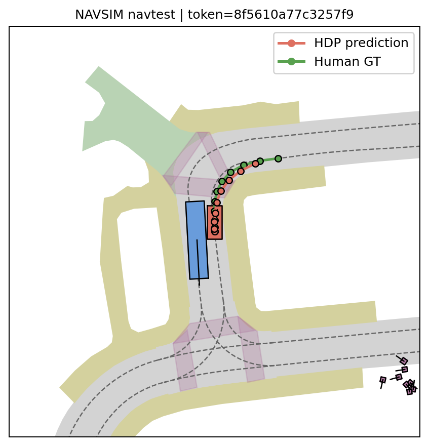
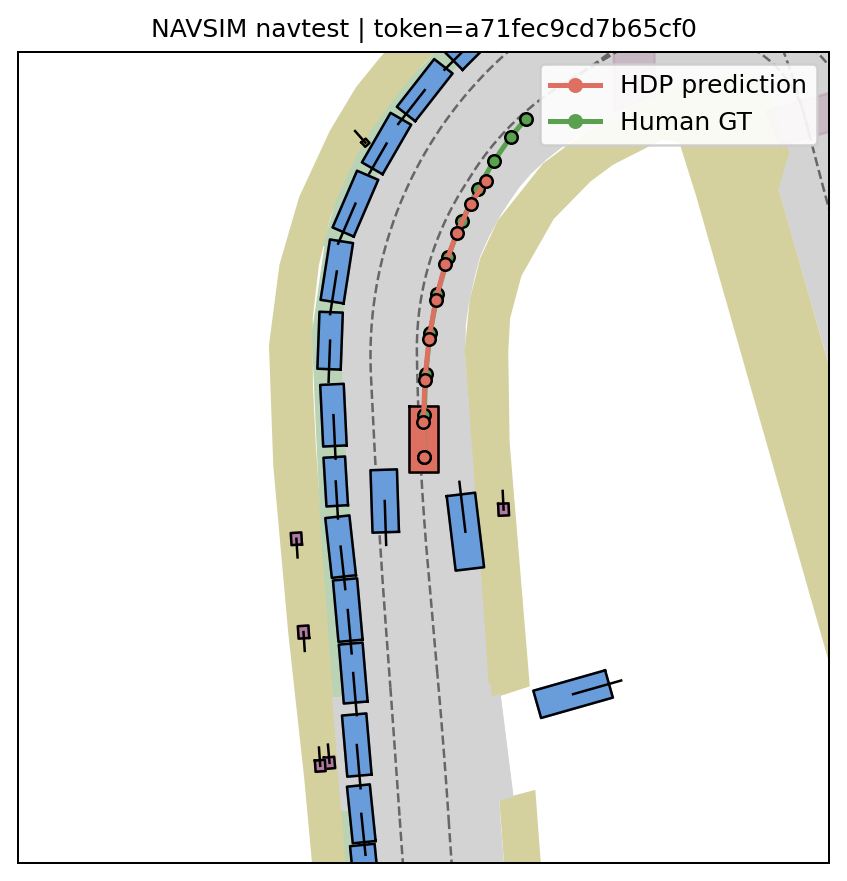

## HDP NAVSIM 记录

- 数据集暂时保存在/mnt/workspace/users/ExplorerX/NAVSIM/dataset，后续跑通全流程无错误再转移到shared/pnc

- 数据集包含两部分：navtrain（不包含ego历史帧，仅包含当前帧的传感器数据，约350GB）和navtest（约100GB），navtrain 103288个场景， navtest 12146个场景

- map没有单独下载，使用nuplan的地图

- conda环境：navsim

### Package Version ：

\- navsim v1\.1

\- nuplan 1\.2\.2

**NOTE: 相关数据存放路径定义在env\.sh中**

## 1\. IL training cache preparation

这个阶段只进行 NAVSIM 原始数据解析和序列化，L/R/F三路图像路径、四帧ego 状态（4 \* 11）、ego  未来轨迹

每帧状态：[x, y, heading, left, straight, right, unknow, vx, vy, ax, ay]

[Left, straight, right, unknown]是 one-hot，用于生成语言prompt

未来轨迹：4s，2hz，8个轨迹点 [x, y, cos, sin]


添加 “\+” 到agent\.config\.pretrain\.checkpoint\_path 在 \`run\_cache\_training\.sh\` , 否则有hydra报错

```Bash
"${LAUNCHER[@]}" "${HDP_NAVSIM_ROOT}/${PY_ENTRY}" \
    agent="${AGENT}" \
    experiment_name="cache_${AGENT}" \
    train_test_split="${SPLIT}" \
    cache_path="${CACHE_PATH}" \
    force_cache_computation=true \
    +agent.config.pretrain_config.checkpoint_path="${CHECKPOINT_PATH}" \
    +cache_data_list_path="${CACHE_DATA_LIST_PATH}" \
    "$@"
```

启动命令

```Plain Text
cd /mnt/workspace/users/ExplorerX/NAVSIM/Hyper-Diffusion-Planner/HDP-navsim
source /mnt/workspace/miniconda3/bin/activate navsim
bash ./scripts/training/run_cache_training.sh dp_vla_agent navtrain
```

生成/navsim\-exp/training\_cache下的\.gz文件：

```Plain Text
training_cache/
└── <log_name>/
    └── <token>/
        ├── dp_vla_feature.gz
        └── dp_vla_target.gz
```

同时生成/mnt/workspace/users/ExplorerX/NAVSIM/Hyper\-Diffusion\-Planner/HDP\-navsim/hdp\_navsim/training/training\_utils/trainval\.json（记录了训练数据帧的路径）：保存的是 \`\<log\_name\>/\<token\>\` 相对路径列表，它不是特征数据本身。训练时先从 JSON 取得样本路径，再到 \`$HDP\_NAVSIM\_CACHE\_PATH\` 中读取对应的 \`\.gz\` 文件。

## 2\. IL training


从huggingface下载Florence\-2\-Large模型和权重 https://huggingface\.co/microsoft/Florence\-2\-large

\- NOTE: model\.safetensors is about 1\.5Gb


设置env\.sh中的 \`export DP\_VLA\_ENCODER\_PATH="/mnt/workspace/users/ExplorerX/NAVSIM/Hyper\-Diffusion\-Planner/HDP\-navsim/Florence\-2\-large"\` 

修改epoch，learning rate，accumulate\_grad\_batches，在default\_training\.yaml，然后启动IL训练

```Plain Text
cd /mnt/workspace/users/ExplorerX/NAVSIM/Hyper-Diffusion-Planner/HDP-navsim
source /mnt/workspace/miniconda3/bin/activate navsim
DP_VLA_NPROC=8 \
bash ./scripts/training/run_training.sh \
  train_test_split=navtrain \
  dataloader.params.batch_size=2
```

此阶段，构建VLA模型，Florence\-2权重会被更新。按官方文档的说法，Florence\-2模型可以替换为其他的VLM模型

```Plain Text
Florence-2 vision/language encoder
    +
CustomDiT diffusion decoder
```

DP\-VLA 使用 Florence 的视觉编码和语言 encoder。Florence 原始的 language decoder 和 LM head 在模型初始化时会被删除，因为轨迹规划不需要生成文本。

因此：

- Florence vision tower：参与前向传播并更新；

- Florence language encoder：参与前向传播并更新；

- Florence language decoder：已删除，不参与；

- Florence LM head：已删除，不参与；

- tokenizer/image processor：不是可训练参数，不更新；

- CustomDiT diffusion decoder：参与前向传播并更新。

## 3\. navtest and navtrain metric caching

生成metric\_cache目录下的\.pkl文件，包含：

\- \`ego\_state\`

\- 当前场景起点的 ego 状态和车辆参数。

\- \`trajectory\`

\- PDM\-Closed planner 为该场景计算的参考轨迹。

\- \`observation\`

\- 未来时间范围内其他交通参与者的位置、朝向和占用区域。

\- 用于碰撞和 TTC 检查。

\- \`centerline\`

\- 当前路线对应的道路中心线。

\- 用于计算沿路线的前进距离。

\- \`route\_lane\_ids\`

\- 路线包含的 lane/lane connector ID。

\- 用于判断行驶方向和路线合规性。

\- \`drivable\_area\_map\`

\- 道路、车道、路口和可行驶区域的多边形地图。

\- 用于判断车辆是否驶出可行驶区域或进入逆向车道。

```Bash
cd /mnt/workspace/users/ExplorerX/NAVSIM/Hyper-Diffusion-Planner/HDP-navsim
source /mnt/workspace/miniconda3/bin/activate navsim
bash ./scripts/evaluation/run_metric_caching.sh             # default navtest
bash ./scripts/evaluation/run_metric_caching.sh navtrain    # navtrain
```

在navsim\_exp下生成\.pkl和metric\_cache\_metadarta\.csv，navtrain和navtest生成的\.pkl保存在同一个目录

```Plain Text
metric_cache/
└── <log_name>/
    └── <scenario_type>/
        └── <token>/
            └── metric_cache.pkl
```

注意这里有个BUG，在第二次运行navtrain的时候会覆盖navtest生成的metadata\.csv，所以需要合并两次的csv：

```Plain Text
CACHE_ROOT=/mnt/workspace/users/ExplorerX/NAVSIM/Hyper-Diffusion-Planner/HDP-navsim/navsim-exp/metric_cache
META="$CACHE_ROOT/metadata/metric_cache_metadata_node_0.csv"

# 备份当前 navtrain metadata
cp "$META" "${META}.navtrain.bak"

# 根据所有实际 cache 文件重建统一 metadata
{
  echo "file_name"
  find "$CACHE_ROOT" -type f -name metric_cache.pkl | sort
} > "$META"

wc -l "$META"
```


该阶段会计算并保存之后进行仿真评分所需的场景信息。这里主要使用：

- 地图、route 和 centerline 处理；

- 未来交通参与者 observation 处理。

LQR tracker、kinematic bicycle model 和 PDM scorer 不在 metric caching 阶段执行。它们是在后续 RL rollout 或 IL/RL evaluation 阶段读取 `metric_cache.pkl` 后才运行。


**相当于未来一段时间内的环境（non\-reactive），metric cache可被其他模型复用，所有在navsim上评测的模型都要使用这个metric cache**

## 4\. RL training caching

缓存Florence encoder 特征，因为在RL Fine\-Tune阶段不调Florence特征，只调Diffusion Decoder

生成rl\_training\_cache目录下的\.gz文件

包含 Florence encode output，[1, 475, 1024]和相应的四帧ego 状态[4, 11]


这里使用了DP\-VLA预训练179epoch

```Bash
cd /mnt/workspace/users/ExplorerX/NAVSIM/Hyper-Diffusion-Planner/HDP-navsim
source /mnt/workspace/miniconda3/bin/activate navsim

DP_VLA_NPROC=1 bash ./scripts/training/run_cache_training.sh \
  dp_vla_rl_agent navtrain \
  agent.config.pretrain_config.checkpoint_path=/mnt/workspace/users/ExplorerX/NAVSIM/Hyper-Diffusion-Planner/HDP-navsim/navsim-exp/dp_vla_agent/2026.07.20.22.03.13/hf_checkpoints/epoch_179
```


## 5\. RL fine\-tune

```Bash
cd /mnt/workspace/users/ExplorerX/NAVSIM/Hyper-Diffusion-Planner/HDP-navsim
source /mnt/workspace/miniconda3/bin/activate navsim
DP_VLA_SPLIT=navtrain \
DP_VLA_NPROC=8 \
bash ./scripts/training/run_training_rl.sh \
  agent.config.pretrain_config.checkpoint_path=/mnt/workspace/users/ExplorerX/NAVSIM/Hyper-Diffusion-Planner/HDP-navsim/navsim-exp/dp_vla_agent/2026.07.20.22.03.13/hf_checkpoints/epoch_179 \
  agent.config.rl_config.data_list_path=/mnt/workspace/users/ExplorerX/NAVSIM/Hyper-Diffusion-Planner/HDP-navsim/hdp_navsim/training/training_utils/trainval.json \
  dataloader.params.batch_size=4 \
  trainer.params.precision=bf16-mixed    # 不加这个会报错
```


## 6\. IL evaluation

```Bash
cd /mnt/workspace/users/ExplorerX/NAVSIM/Hyper-Diffusion-Planner/HDP-navsim
source /mnt/workspace/miniconda3/bin/activate navsim
export DP_VLA_CKPT=/mnt/workspace/users/ExplorerX/NAVSIM/Hyper-Diffusion-Planner/HDP-navsim/navsim-exp/dp_vla_agent/2026.07.20.22.03.13/hf_checkpoints/epoch_179
bash ./scripts/evaluation/run_pdm_score.sh
```

在navsim\_exp下生成\.csv文件，最后一行记录了navtest上的平均得分

```Plain Text
12146,average,True,0.9826691915033756,0.9709369339700313,0.8279807147250736,0.9495307096986663,1.0,0.9831631812942533,**0.8887490105186004**
```

## 7\. RL evaluation

使用微调后的decoder需要将之前IL阶段的encoder的ckpt和RL阶段的decoder的ckpt合并，生成一个merged ckpt。这里使用的50epoch RL

```Bash
cd /mnt/workspace/users/ExplorerX/NAVSIM/Hyper-Diffusion-Planner/HDP-navsim
source /mnt/workspace/miniconda3/bin/activate navsim
export DP_VLA_CKPT=/mnt/workspace/users/ExplorerX/NAVSIM/Hyper-Diffusion-Planner/HDP-navsim/navsim-exp/merged_checkpoints/il_179epoch_rl_49epoch
bash ./scripts/evaluation/run_pdm_score.sh
```

未merge：

|no\_at\_fault\_collisions|drivable\_area\_compliance|ego\_progress|time\_to\_collision\_within\_bound|comfort,|driving\_direction\_compliance,|score|
|---|---|---|---|---|---|---|
|0\.3226576650749218|0\.05228058620121851|0\.0042600965237790354|0\.07648608595422361|0\.0|0\.05862012185081508|0\.002006424439761652|

merge：

|no\_at\_fault\_collisions|drivable\_area\_compliance|ego\_progress|time\_to\_collision\_within\_bound|comfort,<br>|driving\_direction\_compliance,|score|
|---|---|---|---|---|---|---|
|0\.9794582578626708|0\.9762061584060596|0\.8386505717007222|0\.945661123003458|0\.9999176683681871|0\.984192326691915|0\.894136184088266|

**相比于IL evaluation ，score有提升0\.01**

## 8. Visualization
新建了可视化脚本，在navtest中随机抽一些场景，模型推理，绘图
```
cd /home/wangjunbo/Hyper-Diffusion-Planner/HDP-navsim/scripts/visualization

bash ./viz.sh
```





# IL、RL Training Cache 与 Metric Cache 说明


## 1\. 三种 Cache 的总体区别


IL/RL training cache：描述模型吃什么、训练什么。

PDM metric cache：描述生成的轨迹在什么道路和交通环境中被仿真、评分。

这三种 cache 通过同一个场景 \`token\` 对齐。

\-\-\-

## 2 IL cache 的作用

IL 训练数据流为：

```Plain Text
dp_vla_feature.gz
    ↓
读取三路图片并生成语言 prompt
    ↓
Florence-2 在线编码图片和文本
    ↓
DiT diffusion decoder 预测未来轨迹
    ↓
与 dp_vla_target.gz 中的 GT 轨迹计算 diffusion loss
```


因此，IL 训练期间 Florence\-2 仍然参与前向传播和训练。IL cache 的主要作用是避免每次训练启动时重新解析原始 NAVSIM scene，同时避免把巨大的图片像素直接写入 cache。


IL cache 与具体的 Florence checkpoint 通常无关，因为它没有保存 Florence hidden states。只有原始数据、相机选择、历史帧数、未来轨迹采样或预处理逻辑发生变化时，才需要重新生成。

\-\-\-

## 3 RL cache 的作用


RL 训练需要为一个场景生成多条候选轨迹并计算 reward。如果每次 rollout 都重新运行 Florence\-2，会占用大量显存和时间。因此仓库提前缓存 Florence encoder 输出，RL 训练时只加载 diffusion decoder：

```Plain Text
dp_vla_rl_feature.gz 中的 encoder_output
    ↓
diffusion decoder 生成一组候选轨迹
    ↓
根据 token 查找对应的 metric cache
    ↓
PDM 仿真并计算 reward
    ↓
候选轨迹和 reward 写入 replay buffer
    ↓
reward-weighted diffusion loss 更新 decoder
```

RL cache 依赖生成它时使用的 Florence encoder 和监督训练 checkpoint。更换以下任意一项后，建议重新生成 RL cache：


\- Florence\-2 模型或 Florence 权重；

\- IL/监督训练后的 DP\-VLA checkpoint；

\- 图片或语言预处理方式；

\- encoder hidden size、tokenizer 或模型结构。


`agent.config.pretrain_config.checkpoint_path` 应当指向完整的监督训练 DP\-VLA checkpoint，例如 Lightning \`last\.ckpt\` 或 DP\-VLA Hugging Face 导出目录，而不是只指向原始 \`Florence\-2\-large\` 目录。Florence 的单独路径由 \`DP\_VLA\_ENCODER\_PATH\` 指定。

## 4\. PDM Metric Cache

RL rollout 或模型评测时才执行：

```Plain Text
当前模型生成的轨迹
    +
metric_cache.pkl 中的场景环境
    ↓
PDMSimulator
    ↓
PDMScorer
    ↓
本次轨迹对应的 PDMScore
```

### 4\.1 PDM 内部如何使用 metric cache


模型默认输出未来 4 秒、0\.5 秒间隔的 8 个轨迹点。PDM 会：


1\. 将模型的 ego 相对坐标轨迹转换成世界坐标。

2\. 将轨迹插值为 0\.1 秒间隔。

3\. 使用 LQR tracker 跟踪参考轨迹。

4\. 使用 kinematic bicycle model 每 0\.1 秒推进一次 ego 状态。

5\. 将模拟得到的 ego 多边形与 metric cache 中对应时刻的交通参与者和地图进行比较。

6\. 计算碰撞、可行驶区域、前进距离、TTC、舒适性和行驶方向等指标。

7\. 聚合得到该候选轨迹的最终 PDMScore。

**因此，PDM 中的“滚动”是车辆运动学状态沿 4 秒时间轴逐步推进，不是每 0\.1 秒重新读取相机并再次调用模型规划。其他交通参与者按照 metric cache 中记录的未来状态运动，不会对 ego 的新行为做出实时反应。**

\-\-\-


